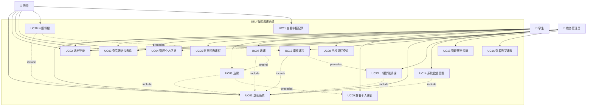
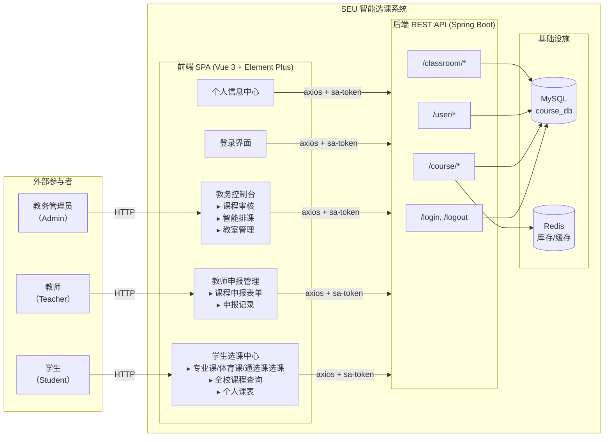

# 用例视图（场景）

## 一、用例视图概述

本视图从外部用户（学生、教师、教务管理员）的角度描述"SEU智能选课系统"的功能需求。系统是一个基于B/S架构的在线选课平台，支持课程申报、审核、排课、选课、退课等完整教务流程。所有其他视图（逻辑视图、开发视图、进程视图、物理视图）均以本用例视图为指导，共同构成"4+1"架构视图模型。

系统边界明确：前端为Vue 3单页应用，后端为Spring Boot RESTful API服务，前端通过HTTP协议与后端交互。参与者完全在系统外部，通过Web浏览器与系统交互。

---

## 二、系统参与者（Actors）

| 参与者 | 角色标识 | 描述 | 对应实体 |
|--------|----------|------|----------|
| **学生** | `student` | 选课系统的主要使用者。登录后可浏览可选课程、按类别选课/退课、查看个人课表。学生具有所属专业（major）属性，影响可选课程范围。 | `UserStudent` |
| **教师** | `teacher` | 课程的申报者。登录后可提交新课申请（含课程信息、时间偏好、地点偏好），查看申报记录及审核状态。 | `UserTeacher` |
| **教务管理员** | `admin` | 系统的管理者。登录后可审核教师申报的课程、执行一键智能排课、管理系统数据重置、查看教室资源及教室课表。 | `UserAdmin` |

> **说明**：系统不区分"未登录用户"——所有功能操作均需先通过身份认证。登录界面允许用户选择角色（学生/教师/教务），系统根据角色分流至不同的功能菜单。

---

## 三、用例图



---

## 四、用例详细描述

### 4.1 学生用例

---

#### UC01 — 登录系统

| 项目 | 内容 |
|------|------|
| **用例编号** | UC01 |
| **用例名称** | 登录系统 |
| **参与者** | 学生、教师、教务管理员 |
| **前置条件** | 用户拥有有效的系统账号；后端服务和数据库正常运行 |
| **后置条件** | 用户进入系统主界面（仪表盘）；Sa-Token会话创建；前端localStorage保存token和用户信息 |
| **基本流程** | 1. 用户访问系统，看到登录界面（背景图+登录表单）<br>2. 用户在角色单选组中选择身份（学生/教师/教务）<br>3. 用户输入账号和密码<br>4. 用户点击"立即登录"按钮或按Enter键<br>5. 前端将`{username, password, role}`以POST方式发送至`/login`<br>6. 后端根据role查询对应的用户表，对密码进行SHA-256哈希比对<br>7. 验证通过后，Sa-Token创建会话，将role、name、major存入Session<br>8. 后端返回token、用户信息（id, name, role, avatar, major）<br>9. 前端保存token到localStorage（key: `satoken`），保存用户信息到localStorage（key: `user_info`）<br>10. 前端切换至主应用界面，默认显示数据仪表盘 |
| **异常流程** | 3a. 账号或密码为空 → 前端提示"请输入账号密码"<br>5a. 后端返回`code≠200` → 前端显示错误消息<br>5b. 网络不通 → 前端提示"无法连接服务器"<br>6a. 账号不存在或密码错误 → 返回"账号或密码错误" |
| **涉及接口** | `POST /login` |

---

#### UC02 — 退出登录

| 项目 | 内容 |
|------|------|
| **用例编号** | UC02 |
| **用例名称** | 退出登录 |
| **参与者** | 学生、教师、教务管理员 |
| **前置条件** | 用户已登录 |
| **后置条件** | Sa-Token会话销毁；前端清除localStorage中的token和用户信息；返回登录界面 |
| **基本流程** | 1. 用户点击右上角头像下拉菜单<br>2. 用户选择"退出登录"<br>3. 前端发送`POST /logout`请求<br>4. 后端调用`StpUtil.logout()`销毁会话<br>5. 前端清除localStorage，重置登录状态，显示登录界面 |
| **涉及接口** | `POST /logout` |

---

#### UC03 — 查看数据仪表盘

| 项目 | 内容 |
|------|------|
| **用例编号** | UC03 |
| **用例名称** | 查看数据仪表盘 |
| **参与者** | 学生、教师、教务管理员 |
| **前置条件** | 用户已登录 |
| **后置条件** | 无 |
| **基本流程** | 1. 用户登录后默认进入仪表盘页面，或点击左侧菜单"数据仪表盘"<br>2. 系统展示四个统计卡片：总课程数、已发布课程数、待审核申请数、待排课任务数 |
| **涉及接口** | `GET /course/list`（前端加载allCourses后计算统计值） |

---

#### UC04 — 管理个人信息

| 项目 | 内容 |
|------|------|
| **用例编号** | UC04 |
| **用例名称** | 管理个人信息 |
| **参与者** | 学生、教师、教务管理员 |
| **前置条件** | 用户已登录 |
| **后置条件** | 用户信息更新持久化到数据库 |
| **基本流程** | 1. 用户点击右上角头像 → "个人信息"进入个人中心<br>2. 系统展示用户头像、姓名、角色、账号、注册时间<br>3. 用户可编辑姓名/昵称，点击"保存修改"提交<br>4. 用户可点击头像上的相机图标，从预设头像中选择新头像<br>5. 用户可在"安全设置"区域修改密码（需输入原密码、新密码、确认密码） |
| **异常流程** | 3a. 姓名为空 → 提示"姓名不能为空"<br>5a. 原密码错误 → 后端返回"原密码错误" |
| **涉及接口** | `POST /user/updateInfo`, `POST /user/updatePassword` |

---

#### UC05 — 浏览可选课程

| 项目 | 内容 |
|------|------|
| **用例编号** | UC05 |
| **用例名称** | 浏览可选课程 |
| **参与者** | 学生 |
| **前置条件** | 用户以学生身份登录 |
| **后置条件** | 无 |
| **基本流程** | 1. 学生点击"学生选课中心"下的子菜单（本专业选课/体育课选课/通选课选课）<br>2. 系统根据学生专业（major）调用`GET /course/list-available?major=xxx`获取已发布课程<br>3. 前端根据子菜单类型过滤课程：本专业选课→专业课，体育选课→体育课，通选课选课→通选课<br>4. 系统以卡片网格形式展示课程，每张卡片显示：课程类型标签、课程名、教师、简介、上课时间/地点、已选人数/容量进度条<br>5. 每张卡片底部显示操作按钮（抢课/满员/退选） |
| **涉及接口** | `GET /course/list-available?major=`, `GET /course/my-list` |

---

#### UC06 — 选课

| 项目 | 内容 |
|------|------|
| **用例编号** | UC06 |
| **用例名称** | 选课（抢课） |
| **参与者** | 学生 |
| **前置条件** | 学生已登录；课程状态为"已发布"（status=2）；课程未满员；学生未选过该课程 |
| **后置条件** | 选课记录写入`student_course`表；Redis库存减1；课程`selected_count`加1；前端刷新可选课程列表和个人课表 |
| **基本流程** | 1. 学生在可选课程卡片上点击"抢课"按钮<br>2. 前端发送`POST /course/select?courseId=xxx`（token自动附带）<br>3. 后端校验角色（仅限student）<br>4. 后端校验课程状态（必须为已发布）<br>5. 后端校验幂等性（Redis Set检查是否已选）<br>6. 后端检测时间冲突（遍历已选课程的时间表与新课程对比）<br>7. 后端预减Redis库存（decrement），若库存<0则回滚并提示"手慢了"<br>8. 后端写入`student_course`表，更新`course.selected_count`，Redis Set记录已选<br>9. 发布`CourseSelectedEvent`事件（异步日志审计）<br>10. 前端收到成功响应，触发`COURSE_SELECTED`事件刷新数据 |
| **异常流程** | 3a. 非学生角色 → "只有学生可以选课"<br>4a. 课程未发布 → "课程尚未发布或已下架"<br>5a. 重复选课 → "您已经选过该课程"<br>6a. 时间冲突 → "时间冲突！该时段（周X 第X节）已选课程：《XXX》"<br>7a. 库存不足 → "手慢了！课程已满员" |
| **涉及接口** | `POST /course/select?courseId=` |

---

#### UC07 — 退课

| 项目 | 内容 |
|------|------|
| **用例编号** | UC07 |
| **用例名称** | 退选课程 |
| **参与者** | 学生 |
| **前置条件** | 学生已登录；学生已选该课程 |
| **后置条件** | 选课记录从`student_course`表删除；Redis库存加1；课程`selected_count`减1 |
| **基本流程** | 1. 学生在已选课程卡片上点击"退选"按钮<br>2. 系统弹出确认对话框："确定要退选《XXX》吗？"<br>3. 学生确认后，前端发送`POST /course/drop?courseId=xxx`<br>4. 后端从`student_course`表删除记录<br>5. 后端Redis库存加1，更新`course.selected_count`减1<br>6. 后端Redis Set移除学生ID<br>7. 发布`CourseDroppedEvent`事件<br>8. 前端触发`COURSE_DROPPED`事件刷新数据 |
| **异常流程** | 4a. 未选过该课程 → "您未选修该课程" |
| **涉及接口** | `POST /course/drop?courseId=` |

---

#### UC08 — 全校课程查询

| 项目 | 内容 |
|------|------|
| **用例编号** | UC08 |
| **用例名称** | 全校课程查询 |
| **参与者** | 学生 |
| **前置条件** | 学生已登录 |
| **后置条件** | 无 |
| **基本流程** | 1. 学生点击"学生选课中心 → 全校课程查询"<br>2. 系统以表格形式展示所有课程（课程名、类型、教师、面向专业、学分、时间/地点、状态）<br>3. 学生可在搜索框输入关键词（课程名/教师名）实时过滤结果 |
| **涉及接口** | `GET /course/list` |

---

#### UC09 — 查看个人课表

| 项目 | 内容 |
|------|------|
| **用例编号** | UC09 |
| **用例名称** | 查看个人课表 |
| **参与者** | 学生 |
| **前置条件** | 学生已登录；学生已选课程且课程已排课 |
| **后置条件** | 无 |
| **基本流程** | 1. 学生点击"学生选课中心 → 我的课表"<br>2. 系统调用`GET /course/my-list`获取已选课程及排课信息（scheduleList）<br>3. 前端将排课数据转换为5天×13节的课表网格<br>4. 每门课程以彩色单元格显示（课程名、地点、教师），跨多节的课程自动rowspan合并<br>5. 右上角显示已选课程总数 |
| **涉及接口** | `GET /course/my-list` |

---

### 4.2 教师用例

---

#### UC10 — 申报课程

| 项目 | 内容 |
|------|------|
| **用例编号** | UC10 |
| **用例名称** | 申报课程 |
| **参与者** | 教师 |
| **前置条件** | 教师已登录 |
| **后置条件** | 新课程写入`course`表，状态为"待审核"（status=0）；发布`CourseProposedEvent`事件 |
| **基本流程** | 1. 教师点击左侧菜单"教师申报管理"<br>2. 系统展示课程申报表单，包含：课程名称、教师姓名（自动填充当前用户）、容量（最少20人）、课程类型（专业课/体育课/通选课）、面向专业（可留空表示全校通选）、课程简介、地点类型（教学楼/实验楼/体育馆）、排课意向（5天×13节复选框网格）<br>3. 教师填写表单并勾选期望的上课时间<br>4. 教师点击"提交申请"<br>5. 前端将表单数据（timePreferences为逗号分隔的"天-节"字符串）以POST发送至`/course/propose`<br>6. 后端设置课程状态为0（待审核），写入数据库<br>7. 发布`CourseProposedEvent`事件<br>8. 前端清空时间偏好复选框，显示成功通知 |
| **异常流程** | 5a. 请求失败 → "申报失败" |
| **涉及接口** | `POST /course/propose` |

---

#### UC11 — 查看申报记录

| 项目 | 内容 |
|------|------|
| **用例编号** | UC11 |
| **用例名称** | 查看申报记录 |
| **参与者** | 教师 |
| **前置条件** | 教师已登录；教师曾提交过课程申报 |
| **后置条件** | 无 |
| **基本流程** | 1. 教师在"教师申报管理"页面下方查看"申报记录"表格<br>2. 表格展示课程名、类型、面向专业、地点偏好、简介、状态标签（待审核/待排课/已发布/已驳回）<br>3. 数据来自`GET /course/list`的全量课程列表（前端按当前教师名过滤） |
| **涉及接口** | `GET /course/list` |

---

### 4.3 教务管理员用例

---

#### UC12 — 审核课程

| 项目 | 内容 |
|------|------|
| **用例编号** | UC12 |
| **用例名称** | 审核课程 |
| **参与者** | 教务管理员 |
| **前置条件** | 管理员已登录；存在待审核的课程（status=0） |
| **后置条件** | 课程状态变更为"待排课"（status=1）或"已驳回"（status=3）；发布`CourseAuditedEvent`事件 |
| **基本流程** | 1. 管理员点击"系统管理 → 教务排课控制台"<br>2. 系统以表格展示所有课程（ID、课程名、教师、类型、面向专业、地点偏好、状态、操作）<br>3. 对于状态为"待审核"的课程，操作列显示"通过"和"驳回"按钮<br>4. 管理员点击"通过"→ `POST /course/audit?courseId=xxx&pass=true`，课程状态变为1（待排课）<br>5. 管理员点击"驳回"→ `POST /course/audit?courseId=xxx&pass=false`，课程状态变为3（已驳回） |
| **异常流程** | 4a/5a. 非admin角色 → "无权操作"<br>4a/5a. 课程不存在 → "课程不存在" |
| **涉及接口** | `GET /course/list`, `POST /course/audit?courseId=&pass=` |

---

#### UC13 — 一键智能排课

| 项目 | 内容 |
|------|------|
| **用例编号** | UC13 |
| **用例名称** | 一键智能排课 |
| **参与者** | 教务管理员 |
| **前置条件** | 管理员已登录；存在待排课课程（status=1）；系统中已配置教室资源 |
| **后置条件** | 排课成功的课程状态变为"已发布"（status=2）；生成`course_schedule`记录；Redis初始化课程库存；发布`ScheduleGeneratedEvent`事件 |
| **基本流程** | 1. 管理员在"教务排课控制台"点击"一键智能排课"按钮<br>2. 后端`AutoScheduleService.autoSchedule()`执行：<br>&nbsp;&nbsp;a. 查询所有status=1的课程<br>&nbsp;&nbsp;b. 初始化已排课课程的专业忙碌表和体育课时间锁<br>&nbsp;&nbsp;c. 按优先级排序：体育课 > 专业课 > 通选课<br>&nbsp;&nbsp;d. 对每门课程：<br>&nbsp;&nbsp;&nbsp;&nbsp;— 策略1：优先尝试满足教师的排课意向时间<br>&nbsp;&nbsp;&nbsp;&nbsp;— 策略2（策略1失败时）：自动寻找空闲时段<br>&nbsp;&nbsp;&nbsp;&nbsp;— 检查教室冲突、专业时间冲突（体育课有特殊互斥规则）<br>&nbsp;&nbsp;e. 写入`course_schedule`表，更新课程状态为2<br>&nbsp;&nbsp;f. 初始化Redis库存计数器<br>3. 排课完成后弹出结果对话框（成功/失败数量） |
| **异常流程** | 1a. 非admin角色 → "无权操作"<br>2a. 无待排课课程 → "没有待排课的课程"<br>2b. 无教室资源 → "没有教室资源"<br>2c. 部分课程排课失败 → 结果中列出失败原因 |
| **涉及接口** | `POST /course/auto-schedule` |

---

#### UC14 — 系统数据重置

| 项目 | 内容 |
|------|------|
| **用例编号** | UC14 |
| **用例名称** | 系统数据重置 |
| **参与者** | 教务管理员 |
| **前置条件** | 管理员已登录 |
| **后置条件** | 所有选课记录清空；所有排课记录清空；课程状态回滚至"待排课"（status=1）；`selected_count`归零；Redis中课程相关key全部删除 |
| **基本流程** | 1. 管理员在"教务排课控制台"点击"系统数据重置/Redis修复"按钮<br>2. 系统弹出危险操作确认对话框<br>3. 管理员确认后，前端发送`GET /course/reset-redis`<br>4. 后端执行：<br>&nbsp;&nbsp;a. 清空`student_course`表<br>&nbsp;&nbsp;b. 清空`course_schedule`表<br>&nbsp;&nbsp;c. 将status为1/2/3的课程重置为status=1，selected_count=0<br>&nbsp;&nbsp;d. 将status=0的课程selected_count归零<br>&nbsp;&nbsp;e. 删除Redis中所有`course:*`键<br>5. 发布`SystemResetEvent`事件<br>6. 前端清空本地课表数据，重新加载 |
| **异常流程** | 3a. 非admin角色 → "无权操作"<br>4a. 操作异常 → 事务回滚，"重置失败" |
| **涉及接口** | `GET /course/reset-redis` |

---

#### UC15 — 管理教室资源

| 项目 | 内容 |
|------|------|
| **用例编号** | UC15 |
| **用例名称** | 管理教室资源 |
| **参与者** | 教务管理员 |
| **前置条件** | 管理员已登录 |
| **后置条件** | 无 |
| **基本流程** | 1. 管理员点击"系统管理 → 教室资源管理"<br>2. 系统以表格展示所有教室（ID、教室名称、所属楼宇/区域、容量）<br>3. 管理员可在搜索框输入关键词（教室名/位置）过滤教室列表<br>4. 每个教室行提供"查看课表"操作按钮 |
| **涉及接口** | `GET /classroom/list?keyword=` |

---

#### UC16 — 查看教室课表

| 项目 | 内容 |
|------|------|
| **用例编号** | UC16 |
| **用例名称** | 查看教室课表 |
| **参与者** | 教务管理员 |
| **前置条件** | 管理员已登录；目标教室已排课 |
| **后置条件** | 无 |
| **基本流程** | 1. 管理员在教室列表中点击某教室的"查看课表"按钮<br>2. 前端发送`GET /classroom/schedule?roomId=xxx`<br>3. 后端查询该教室的`course_schedule`记录，关联`course`表获取课程名和教师<br>4. 前端以5天×13节课表网格展示该教室一周的课程安排<br>5. 每门课显示课程名、教师、课程类型<br>6. 管理员可点击返回按钮回到教室列表 |
| **涉及接口** | `GET /classroom/schedule?roomId=` |

---

## 五、系统概述图（用例上下文图）



---

## 六、用例关系与业务流程说明

### 6.1 课程生命周期（核心业务流程）

```
教师申报(UC10) ──→ 管理员审核(UC12) ──→ 管理员排课(UC13) ──→ 学生选课(UC06)
     │                    │                      │                   │
     ▼                    ▼                      ▼                   ▼
  status=0            status=1               status=2          选课记录写入
  (待审核)       通过→(待排课)             (已发布)          student_course
                 驳回→status=3                              Redis库存-1
                     (已驳回)
```

### 6.2 用例包含（Include）关系

| 基础用例 | 包含用例 | 说明 |
|----------|----------|------|
| UC06 选课 | UC01 登录 | 选课操作要求用户已通过身份认证（token校验） |
| UC07 退课 | UC01 登录 | 退课操作要求用户已通过身份认证 |
| UC10 申报课程 | UC01 登录 | 申报操作要求教师已登录 |
| UC12 审核课程 | UC01 登录 | 审核操作要求管理员已登录 |
| UC13 智能排课 | UC01 登录 | 排课操作要求管理员已登录 |
| UC14 系统重置 | UC01 登录 | 重置操作要求管理员已登录 |

### 6.3 用例扩展（Extend）关系

| 基础用例 | 扩展用例 | 说明 |
|----------|----------|------|
| UC06 选课 | UC07 退课 | 退课是选课的逆操作，在已选课程上下文中触发 |

### 6.4 前置依赖关系

| 前置用例 | 后置用例 | 说明 |
|----------|----------|------|
| UC10 申报课程 | UC12 审核课程 | 只有教师申报了课程，管理员才能审核 |
| UC12 审核课程（通过） | UC13 智能排课 | 只有审核通过的课程（status=1）才能参与排课 |
| UC06 选课 + UC13 排课 | UC09 查看课表 | 学生选课且课程已排课后，课表才有内容 |

---

## 七、用例视图总结

本用例视图识别了**3类参与者**（学生、教师、教务管理员）和**16个用例**，覆盖了在线选课系统的完整功能流程：

| 维度 | 说明 |
|------|------|
| **学生功能域** | 登录认证、仪表盘概览、分类选课（专业课/体育课/通选课）、退课、全校课程检索、个人课表查看、个人信息管理 |
| **教师功能域** | 登录认证、仪表盘概览、课程申报（含时间偏好设置）、申报记录查看、个人信息管理 |
| **管理功能域** | 登录认证、仪表盘概览、课程审核（通过/驳回）、一键智能排课（带优先级和冲突检测）、系统数据重置、教室资源查看、教室课表查看、个人信息管理 |
| **安全保障** | 所有功能操作均以登录认证（UC01）为前提；后端通过Sa-Token会话进行角色校验和IDOR防护；选课操作使用Redis实现并发库存控制 |
| **事件驱动** | 关键业务操作（选课、退课、申报、审核、排课、重置）通过Spring事件机制+前端mitt事件总线实现异步审计和解耦通知 |
