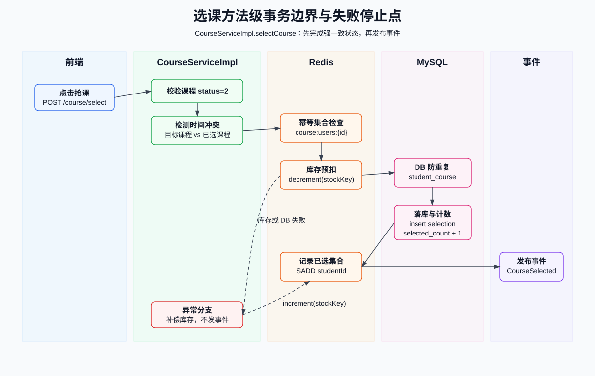
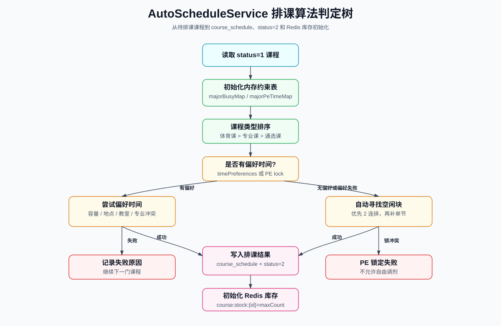
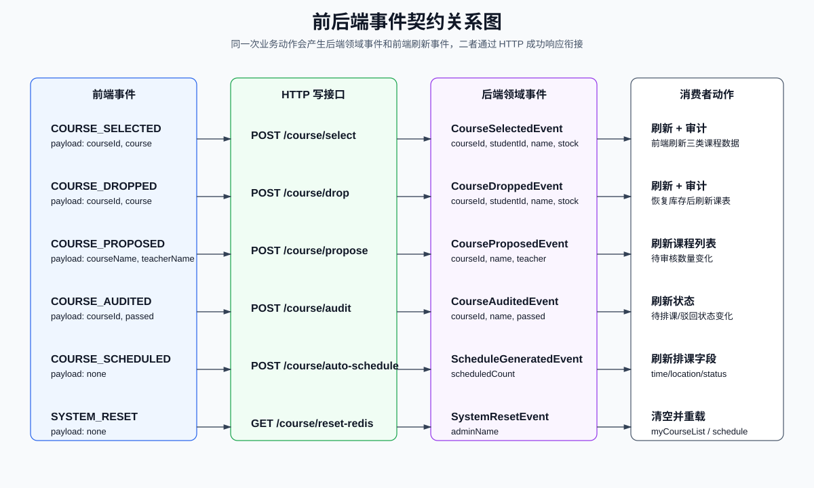

# 第二章 详细设计报告

---

## 一、前端详细设计

### 1.1 前端状态变量设计

前端仍是单组件 SPA，但 `App.vue` 内的状态可以按职责拆成若干状态组。每组状态只服务于特定页面或事件消费者，避免把所有变量视为一份无结构的全局状态。

| 状态组 | 变量 | 类型 | 写入位置 | 读取位置 | 设计说明 |
|---|---|---|---|---|---|
| 登录状态 | `isLoggedIn` | `ref<boolean>` | 登录成功、退出、401 失效、页面恢复 | 模板根分支 | 控制登录页与主应用切换 |
| 用户上下文 | `currentUser` | `ref<object>` | 登录成功、`localStorage` 恢复、资料更新 | 菜单、接口参数、角色判断 | 保存 id、name、role、avatar、major |
| 菜单状态 | `activeMenu` | `ref<string>` | 菜单点击、登录成功、个人中心跳转 | 各页面 `v-if` | 充当前端轻量路由 |
| 课程全集 | `allCourses` | `ref<Course[]>` | `fetchCourses` | 仪表盘、审核、排课、全校查询 | 来源为 `/course/list` |
| 可选课程 | `availableCourses` | `ref<Course[]>` | `fetchAvailableCourses` | 学生选课卡片 | 来源为 `/course/list-available?major=` |
| 已选课程 | `myCourseList` | `ref<Course[]>` | `fetchMyCourses`、系统重置事件 | 已选判断、个人课程 | 来源为 `/course/my-list` |
| 个人课表 | `myScheduleCells` | `ref<Cell[]>` | `fetchMyCourses`、系统重置事件 | 课表网格 | 从 `scheduleList` 展开而来 |
| 教师申报表 | `teacherForm` | `reactive<object>` | 表单输入、申报成功重置偏好 | 申报接口 | 保存课程字段和时间偏好 |
| 教室状态 | `classroomList`、`classroomScheduleList`、`currentClassroom` | `ref` | 教室查询、查看课表、返回列表 | 教室管理页面 | 支持教室列表与教室课表两种视图 |
| 交互状态 | `btnLoading`、`scheduing`、`loading` | `reactive/ref` | 请求开始和结束 | 按钮、加载效果 | 防止重复点击并反馈异步进度 |

### 1.2 前端计算属性设计

| 计算属性 | 输入 | 输出 | 设计约束 |
|---|---|---|---|
| `publishedCourses` | `allCourses` | `status === 2` 的课程 | 只用于统计，不修改课程对象 |
| `pendingAuditCount` | `allCourses` | 待审核数量 | 与 `status === 0` 保持一致 |
| `pendingScheduleCount` | `allCourses` | 待排课数量 | 与 `status === 1` 保持一致 |
| `myProposals` | `allCourses`、`teacherForm.teacherName` | 当前教师相关课程 | 教师名为空时返回全部，便于初始加载 |
| `filteredAllCourses` | `allCourses`、`searchKeyword` | 按课程名或教师名过滤后的列表 | 搜索只影响展示，不影响源列表 |

### 1.3 前端核心方法契约

| 方法 | 输入 | 前置条件 | 成功后动作 | 失败处理 |
|---|---|---|---|---|
| `handleLogin` | `loginForm` | 用户名和密码非空 | 保存 token 和用户信息；设置登录态；调用 `initData()`；发布 `AUTH_LOGIN` | 后端错误显示 `msg`；网络错误提示无法连接服务器 |
| `handleCommand('logout')` | 命令字符串 | 用户已登录 | 调用 `/logout`；清理 token、用户信息和课程状态；发布 `AUTH_LOGOUT` | 使用 `finally` 保证前端本地状态被清理 |
| `fetchCourses` | 无 | 用户已登录或页面恢复中 | 写入 `allCourses` | 失败提示“获取课程列表失败，请检查后端服务” |
| `fetchAvailableCourses` | 当前学生专业 | `currentUser.role === 'student'` | 写入 `availableCourses` | 控制台记录错误，不阻断主页面 |
| `fetchMyCourses` | 当前 token | 学生已登录 | 写入 `myCourseList`，并生成 `myScheduleCells` | 失败提示“获取我的课程失败” |
| `handleSelect` | 课程对象 | 课程未满员、按钮未处于加载态 | 选课成功提示；发布 `COURSE_SELECTED` | 后端错误显示具体原因；网络错误显示选课失败 |
| `handleDrop` | 课程对象 | 用户确认退课 | 退课成功提示；发布 `COURSE_DROPPED` | 失败提示网络请求失败 |
| `submitProposal` | `teacherForm` | 教师已登录 | 组装 `timePreferences`；提交课程；发布 `COURSE_PROPOSED`；清空偏好 | 失败提示申报失败 |
| `handleAudit` | 课程对象、审核结果 | 管理员已登录 | 调用审核接口；发布 `COURSE_AUDITED` | 失败提示操作失败 |
| `handleAutoSchedule` | 无 | 管理员已登录 | 调用自动排课接口；发布 `COURSE_SCHEDULED` | 失败提示排课失败 |
| `handleResetSystem` | 无 | 管理员二次确认 | 调用重置接口；发布 `SYSTEM_RESET` | 后端错误显示 `msg`，异常提示操作失败 |

### 1.4 前端事件消费者设计

事件消费者集中注册在 `onMounted` 中。它们只刷新本地状态，不重新执行业务写操作。

| 事件 | 消费者动作 | 设计理由 |
|---|---|---|
| `COURSE_SELECTED` | `fetchMyCourses()` + `fetchAvailableCourses()` + `fetchCourses()` | 个人课表、可选余量和总课程统计都可能变化 |
| `COURSE_DROPPED` | `fetchMyCourses()` + `fetchAvailableCourses()` + `fetchCourses()` | 退课会影响个人课表、库存余量和已选人数 |
| `COURSE_PROPOSED` | `fetchCourses()` | 新课程进入待审核列表 |
| `COURSE_AUDITED` | `fetchCourses()` | 课程状态从待审核变为待排课或已驳回 |
| `COURSE_SCHEDULED` | `fetchCourses()` | 排课后课程状态、时间和地点发生变化 |
| `SYSTEM_RESET` | 清空 `myCourseList`、`myScheduleCells`，再调用 `initData()` | 重置后个人课表和课程状态都要回到后端事实源 |
| `DATA_REFRESH_ALL` | `initData()` | 通用刷新入口 |
| `DATA_REFRESH_COURSES` | `fetchCourses()` | 通用课程列表刷新入口 |

`AUTH_LOGIN` 和 `AUTH_LOGOUT` 当前已经发布但未注册消费者，保留为后续前端审计、消息中心初始化、埋点或缓存清理入口。

### 1.5 前端课表单元格设计

后端返回的是离散 `CourseSchedule` 记录，前端负责转换为课表单元格。

| 目标结构 | 字段 | 来源 | 用途 |
|---|---|---|---|
| `myScheduleCells[]` | `id` | `course.id` | 判断同一门课是否为连续节次 |
| `myScheduleCells[]` | `name` | `course.name` | 在课表单元格中显示课程名 |
| `myScheduleCells[]` | `location` | `course.scheduleLocation` | 在课表单元格中显示上课地点 |
| `myScheduleCells[]` | `day` | `schedule.dayOfWeek` | 定位课表列，即周几 |
| `myScheduleCells[]` | `slot` | `schedule.timeSlot` | 定位课表行，即第几节 |

渲染规则：

1. `getCourse(day, slot)` 查找当前格子的课程。
2. `shouldShowCell(day, slot)` 判断当前格是否需要显示。若上一节存在同一课程，则当前格隐藏。
3. `getCellRowspan(day, slot)` 从当前节向后扫描连续相同课程，计算合并行数。
4. 教室课表使用 `getClassroomCourse`、`shouldShowClassroomCell`、`getClassroomRowspan` 复用同一合并思想。

---

## 二、后端 HTTP 入口详细设计

### 2.1 `LoginController`

| 方法 | 路径 | 输入 | 输出 | 详细设计 |
|---|---|---|---|---|
| `login` | `POST /login` | `LoginDTO(username,password,role)` | token、用户 id、姓名、角色、头像、专业 | 按角色选择用户表；对输入密码做 SHA-256；校验成功后调用 `StpUtil.login(userId)`；Session 写入 `role`、`name`，学生额外写入 `major` |
| `logout` | `POST /logout` | token 请求头 | `退出成功` | 调用 `StpUtil.logout()` 销毁会话 |

登录设计的关键点是“后端会话是身份事实源”。后续选课、退课、我的课程等接口都从 Sa-Token 读取当前用户，而不是信任前端传入学生 ID。

### 2.2 `CourseController`

| 方法 | 路径 | 参数 | 调用对象 | 成功结果 | 事件发布 |
|---|---|---|---|---|---|
| `list` | `GET /course/list` | 无 | `courseService.getListWithSchedule()` | 返回全部课程及展示排课字段 | 无 |
| `listAvailable` | `GET /course/list-available` | `major` | `courseService.getAvailableCourses(major)` | 返回可选课程 | 无 |
| `myList` | `GET /course/my-list` | 当前 token | `courseService.getMyCourses(currentId)` | 返回当前学生已选课程 | 无 |
| `selectCourse` | `POST /course/select` | `courseId` | `courseService.selectCourse(currentId, courseId)` | 返回“选课成功” | Service 内发布 |
| `dropCourse` | `POST /course/drop` | `courseId` | `courseService.dropCourse(currentId, courseId)` | 返回“退课成功” | Service 内发布 |
| `proposeCourse` | `POST /course/propose` | `Course` 请求体 | `courseMapper.insert(course)` | 课程状态为待审核 | `courseProposed` |
| `auditCourse` | `POST /course/audit` | `courseId`、`pass` | `courseMapper.updateById(course)` | 课程状态更新 | `courseAudited` |
| `autoSchedule` | `POST /course/auto-schedule` | 当前 token | `autoScheduleService.autoSchedule()` | 返回排课结果文本 | `scheduleGenerated` |
| `resetSystem` | `GET /course/reset-redis` | 当前 token | `courseService.resetSystem()` | 返回重置成功 | Service 内发布 |

入口层约束：

- 写操作不得从前端接收 `studentId` 作为事实身份。
- 管理员接口必须检查 Session 中的 `role`。
- 查询接口不发布事件。
- 写接口只有在核心状态修改完成后才发布事件。
- 当前 `proposeCourse` 和 `auditCourse` 直接使用 Mapper，后续可下沉到 Service，使 Controller 只负责编排。

### 2.3 `ClassroomController`

| 方法 | 路径 | 参数 | 输出 | 详细设计 |
|---|---|---|---|---|
| `list` | `GET /classroom/list` | 可选 `keyword` | 教室列表 | keyword 同时匹配 `room_name` 和 `location`，按地点和名称升序 |
| `getSchedule` | `GET /classroom/schedule` | `roomId` | 教室课表格子列表 | 先查 `course_schedule`，再批量查课程，组装 `day`、`slot`、`courseName`、`teacherName`、`type`、`id` |

该控制器不发布事件，因为教室查询只读取已有排课结果，不改变业务状态。

### 2.4 `UserController`

| 方法 | 路径 | 输入 | 更新对象 | 输出 |
|---|---|---|---|---|
| `updateInfo` | `POST /user/updateInfo` | `role`、`id`、`realName`、`avatar` | 对应角色用户表 | `信息更新成功` |
| `updatePassword` | `POST /user/updatePassword` | `role`、`id`、`oldPass`、`newPass` | 对应角色用户表 | `密码修改成功，请重新登录` |

用户资料接口当前按 `role` 分支处理三类用户。后续若用户字段继续增加，可抽取统一的用户资料服务，降低三段分支重复。

---

## 三、后端业务服务详细设计

### 3.1 `CourseServiceImpl.selectCourse`

选课方法是系统中最关键的写路径，事务边界如下图。



| 设计项 | 内容 |
|---|---|
| 方法 | `selectCourse(Long studentId, Long courseId)` |
| 事务 | `@Transactional(rollbackFor = Exception.class)` |
| 输入 | 当前登录学生 ID、目标课程 ID |
| 前置条件 | 课程存在且 `status == 2`；学生未选择该课程；课程时间与学生已选课程不冲突；Redis 库存大于 0 |
| 成功后置条件 | `student_course` 新增记录；`course.selected_count` 加 1；Redis `course:users:{id}` 加入学生；发布 `CourseSelectedEvent` |
| 失败后置条件 | 不新增选课记录；若 Redis 已预扣库存则补偿 `increment`；不发布成功事件 |

核心步骤：

```text
1. courseMapper.selectById(courseId)
2. 校验 course.status == 2
3. 构造 stockKey = course:stock:{courseId}
4. 构造 userKey = course:users:{courseId}
5. Redis Set 判断是否已选
6. 查询目标课程排课和学生已选课程排课，检测时间冲突
7. Redis decrement(stockKey)
8. 若 stock < 0，立即 increment(stockKey) 并抛错
9. 数据库再次查询 student_course 防重复
10. 插入 StudentCourse
11. course.selected_count 原子加 1
12. Redis Set 添加 studentId
13. eventPublisher.courseSelected(...)
14. catch 分支补偿 Redis 库存并继续抛出异常
```

关键不变量：

- `student_course` 是最终选课关系事实源。
- Redis 库存用于削峰和快速拒绝，但不是最终事实源。
- 只要数据库落库失败，Redis 库存必须补偿。
- `CourseSelectedEvent` 只能在落库和缓存集合写入之后发布。

### 3.2 `CourseServiceImpl.dropCourse`

| 设计项 | 内容 |
|---|---|
| 方法 | `dropCourse(Long studentId, Long courseId)` |
| 事务 | `@Transactional(rollbackFor = Exception.class)` |
| 输入 | 当前登录学生 ID、目标课程 ID |
| 前置条件 | `student_course` 中存在该学生与课程的关系 |
| 成功后置条件 | 删除选课关系；Redis 库存加 1；`selected_count` 安全减 1；Redis 用户集合移除学生；发布 `CourseDroppedEvent` |
| 失败后置条件 | 若没有选课记录，则抛出“您未选修该课程”；不发布事件 |

`selected_count` 使用 SQL 表达式保证不低于 0：

```sql
selected_count = CASE WHEN selected_count > 0 THEN selected_count - 1 ELSE 0 END
```

### 3.3 `CourseServiceImpl.getMyCourses`

| 步骤 | 设计 |
|---|---|
| 1 | 按 `student_id` 查询 `student_course` |
| 2 | 若无记录，返回空列表 |
| 3 | 提取 `courseId` 后批量查询课程 |
| 4 | 调用 `populateScheduleInfo(courses)` 补充时间、地点和 `scheduleList` |
| 5 | 返回课程列表给前端生成个人课程和课表 |

### 3.4 `CourseServiceImpl.getAvailableCourses`

可选课程过滤规则：

1. 只查询 `status == 2` 的已发布课程。
2. 若学生专业为空，返回全部已发布课程。
3. 若课程 `targetMajors` 为空，视为全校可选。
4. 若课程 `targetMajors` 包含学生专业，允许显示。
5. 返回前调用 `populateScheduleInfo`，保证前端可以显示时间和地点。

### 3.5 `CourseServiceImpl.resetSystem`

| 顺序 | 操作 | 目的 |
|---|---|---|
| 1 | `studentCourseMapper.delete(null)` | 清空选课关系 |
| 2 | `scheduleMapper.delete(null)` | 清空排课结果 |
| 3 | 将 `status in (1,2,3)` 的课程设为 `status = 1`，`selected_count = 0` | 回到待排课状态 |
| 4 | 将 `status = 0` 的课程 `selected_count` 清零 | 待审核课程不参与排课，但人数归零 |
| 5 | 删除 Redis `course:*` 键 | 清空库存和已选集合 |
| 6 | 读取管理员姓名 | 作为事件 payload |
| 7 | 发布 `SystemResetEvent` | 记录重置审计 |

重置后不预热 Redis 库存，因为课程状态回到待排课，不允许学生选课。库存只在重新排课并发布课程时初始化。

### 3.6 `AutoScheduleService.autoSchedule`

排课算法判定流程如下。



| 设计项 | 内容 |
|---|---|
| 方法 | `autoSchedule()` |
| 事务 | `@Transactional(rollbackFor = Exception.class)` |
| 输入 | 数据库中 `status == 1` 的课程、全部教室、已发布课程排课记录 |
| 输出 | 排课结果文本 |
| 成功副作用 | 插入 `course_schedule`；课程状态置为 `2`；Redis 写入 `course:stock:{courseId}` |
| 失败处理 | 单门课程无法排课时记录失败原因，继续尝试下一门 |

算法步骤：

```text
1. 查询待排课课程 pendingCourses
2. 查询教室列表 classrooms
3. 初始化 majorBusyMap 和 majorPeTimeMap
4. 按课程类型排序：体育课 > 专业课 > 通选课
5. 遍历每门课程
6. 读取地点偏好，默认教学楼
7. 读取学分作为需要填充的节次数
8. 先尝试教师 timePreferences
9. 若失败且不是体育课时间锁定课程，则自动寻找空闲时间片
10. 成功后写入排课、更新 busyMap、统计成功数
11. 失败则记录“资源不足或严重冲突”
12. 返回成功/失败统计文本
```

### 3.7 排课辅助结构

| 结构 | 类型 | Key | Value | 作用 |
|---|---|---|---|---|
| `majorBusyMap` | `Map<String,String>` | `专业-周-节` | 占用课程类型 | 判断专业课和体育课冲突 |
| `majorPeTimeMap` | `Map<String,String>` | `专业` | `day-slot` 列表 | 锁定同专业体育课时间 |
| `proposedSlots` | `List<int[]>` | 当前候选课程内部 | `[day, slot]` | 暂存本课程候选排课方案 |

冲突规则：

| 课程类型 | 冲突规则 |
|---|---|
| 通选课 | 不检查专业忙碌，只检查教室占用和自身重复 |
| 专业课 | 与同专业任意已占用时间冲突 |
| 体育课 | 若专业已有体育课时间锁，则必须使用锁定时间；体育课只与专业课冲突，不与同专业体育课冲突 |

### 3.8 `populateScheduleInfo`

该方法把数据库排课记录转换为前端展示字段。

| 输入 | 输出 |
|---|---|
| `List<Course>` | 每门课程补充 `scheduleTime`、`scheduleLocation`、`scheduleList` |

处理步骤：

1. 一次性查询全部 `CourseSchedule`。
2. 按 `courseId` 分组。
3. 查询全部教室并按 `id` 建立 `roomMap`。
4. 对每门课程按周几和节次聚合。
5. 使用 `compressSlots` 把连续节次压缩为 `1-2` 形式。
6. 若无排课记录，则设置 `scheduleTime = "待安排"`，`scheduleLocation = "待定"`。

---

## 四、事件契约详细设计

### 4.1 事件契约总图

下图不是组件树，而是实现级事件契约图，重点标出事件名、payload 和消费动作。



### 4.2 前端事件契约

| 事件常量 | 事件名 | Payload | 发布方法 | 消费动作 |
|---|---|---|---|---|
| `COURSE_SELECTED` | `course:selected` | `{ courseId, course }` | `handleSelect` | 刷新我的课程、可选课程、全部课程 |
| `COURSE_DROPPED` | `course:dropped` | `{ courseId, course }` | `handleDrop` | 刷新我的课程、可选课程、全部课程 |
| `COURSE_PROPOSED` | `course:proposed` | `{ courseName, teacherName }` | `submitProposal` | 刷新全部课程 |
| `COURSE_AUDITED` | `course:audited` | `{ courseId, course, passed }` | `handleAudit` | 刷新全部课程 |
| `COURSE_SCHEDULED` | `course:scheduled` | 无 | `handleAutoSchedule` | 刷新全部课程 |
| `SYSTEM_RESET` | `system:reset` | 无 | `handleResetSystem` | 清空本地课表并全量刷新 |
| `AUTH_LOGIN` | `auth:login` | `{ user }` | `handleLogin` | 当前预留 |
| `AUTH_LOGOUT` | `auth:logout` | 无 | `handleCommand` | 当前预留 |
| `DATA_REFRESH_ALL` | `data:refresh-all` | 无 | 预留 | 全量刷新 |
| `DATA_REFRESH_COURSES` | `data:refresh-courses` | 无 | 预留 | 刷新课程列表 |

前端事件约束：

- `course:*` 事件只在写操作成功后发布。
- payload 不传 `appState`，只传消费者需要的最小信息。
- 消费者只刷新状态，不反向触发同类写操作。
- 页面卸载时注销监听器，避免重复消费。

### 4.3 后端事件契约

| 事件类 | 字段 | 字段含义 | 发布方法 | 监听方法 |
|---|---|---|---|---|
| `CourseSelectedEvent` | `courseId`、`studentId`、`courseName`、`remainingStock` | 选课事实和剩余库存快照 | `courseSelected` | `onCourseSelected` |
| `CourseDroppedEvent` | `courseId`、`studentId`、`courseName`、`remainingStock` | 退课事实和恢复后库存快照 | `courseDropped` | `onCourseDropped` |
| `CourseProposedEvent` | `courseId`、`courseName`、`teacherName` | 课程申报事实 | `courseProposed` | `onCourseProposed` |
| `CourseAuditedEvent` | `courseId`、`courseName`、`passed` | 审核结果 | `courseAudited` | `onCourseAudited` |
| `ScheduleGeneratedEvent` | `scheduledCount` | 排课批次规模 | `scheduleGenerated` | `onScheduleGenerated` |
| `SystemResetEvent` | `adminName` | 执行重置的管理员 | `systemReset` | `onSystemReset` |

后端事件类字段均为 `private final`，构造后不再修改。事件对象只表达“事实已发生”，不执行查询、不写数据库、不直接调用前端。

### 4.4 `CourseEventPublisher` 设计

发布器的职责不是“处理事件”，而是“统一创建事件对象并交给 Spring 容器”。

| 发布器方法 | 创建事件 | 设计收益 |
|---|---|---|
| `courseSelected` | `new CourseSelectedEvent(...)` | 选课事件参数集中校验 |
| `courseDropped` | `new CourseDroppedEvent(...)` | 退课事件字段保持一致 |
| `courseProposed` | `new CourseProposedEvent(...)` | Controller 不直接依赖 Spring 原始发布 API |
| `courseAudited` | `new CourseAuditedEvent(...)` | 审核通过/驳回共用一个事件 |
| `scheduleGenerated` | `new ScheduleGeneratedEvent(...)` | 排课完成统一出口 |
| `systemReset` | `new SystemResetEvent(...)` | 高危操作审计入口 |

### 4.5 `CourseEventListener` 设计

监听器方法使用 `@Async` 和 `@EventListener`。当前消费动作是日志审计，后续可在同一事件下新增通知、统计或审计表写入。

| 监听器方法 | 日志内容 | 不应做的事 |
|---|---|---|
| `onCourseSelected` | 学生、课程、剩余容量 | 不再修改库存或选课关系 |
| `onCourseDropped` | 学生、课程、剩余容量 | 不再恢复库存 |
| `onCourseProposed` | 教师、课程 | 不修改课程状态 |
| `onCourseAudited` | 课程、通过/驳回 | 不二次审核 |
| `onScheduleGenerated` | 排课数量 | 不重新排课 |
| `onSystemReset` | 管理员 | 不重复清库 |

---

## 五、数据对象与状态结构详细设计

### 5.1 `Course`

| 字段 | 类型 | 持久化 | 设计含义 |
|---|---|---|---|
| `id` | `Long` | 是 | 课程主键 |
| `name` | `String` | 是 | 课程名称 |
| `teacherName` | `String` | 是 | 申报教师 |
| `maxCount` | `Integer` | 是 | 容量上限 |
| `selectedCount` | `Integer` | 是 | 已选人数展示值 |
| `status` | `Integer` | 是 | 0 待审核、1 待排课、2 已发布、3 已驳回 |
| `credit` | `Integer` | 是 | 学分，同时影响排课节次数 |
| `timePreferences` | `String` | 是 | 教师偏好时间，格式为 `day-slot,day-slot` |
| `locationPreference` | `String` | 是 | 教学楼、实验楼、体育馆等地点偏好 |
| `targetMajors` | `String` | 是 | 逗号分隔的面向专业 |
| `type` | `String` | 是 | 专业课、体育课、通选课 |
| `intro` | `String` | 是 | 课程简介 |
| `version` | `Integer` | 是 | MyBatis-Plus 乐观锁字段 |
| `scheduleTime` | `String` | 否 | 前端展示用时间文本 |
| `scheduleLocation` | `String` | 否 | 前端展示用地点文本 |
| `scheduleList` | `List<CourseSchedule>` | 否 | 前端课表展开用原始排课 |

### 5.2 其他实体

| 实体 | 表 | 关键字段 | 设计含义 |
|---|---|---|---|
| `CourseSchedule` | `course_schedule` | `courseId`、`classroomId`、`dayOfWeek`、`timeSlot` | 保存课程排课结果 |
| `StudentCourse` | `student_course` | `studentId`、`courseId`、`createTime` | 保存学生选课关系 |
| `Classroom` | `classroom` | `roomName`、`capacity`、`location` | 保存教室资源，并参与容量和地点匹配 |
| `UserStudent` | `user_student` | `username`、`password`、`realName`、`avatar`、`major` | 学生账号和专业 |
| `UserTeacher` | `user_teacher` | `username`、`password`、`realName`、`avatar` | 教师账号 |
| `UserAdmin` | `user_admin` | `username`、`password`、`realName`、`avatar` | 管理员账号 |

建议后续在数据库层增加 `student_course(student_id, course_id)` 唯一索引，作为 Redis 和业务层幂等校验之外的最终兜底。

### 5.3 Redis Key 设计

| Key | 类型 | 写入时机 | 删除时机 | 设计说明 |
|---|---|---|---|---|
| `course:stock:{courseId}` | String/Integer | 自动排课发布课程时；选课/退课调整 | 系统重置 | 课程剩余库存 |
| `course:users:{courseId}` | Set | 学生选课成功 | 学生退课；系统重置 | 已选学生集合，用于幂等判断 |
| `course:*` | Pattern | 多处 | 系统重置 | 重置时批量清理课程相关缓存 |

Redis 与 MySQL 的分工：

- Redis 用于快速判断和削峰，不作为最终账本。
- MySQL 的 `student_course` 和 `course` 表保存最终事实。
- Redis 异常或数据丢失时，应能从 MySQL 重建库存和用户集合。

---

## 六、接口契约详细设计

### 6.1 统一响应格式

后端接口统一返回：

```json
{
  "code": 200,
  "msg": "success",
  "data": {}
}
```

| 字段 | 设计说明 |
|---|---|
| `code` | 业务状态码，成功为 200，失败为 500 或自定义状态码 |
| `msg` | 给前端展示或调试的消息 |
| `data` | 业务数据，可以是对象、数组或字符串 |

前端事件发布原则上应以业务成功码为准。当前部分方法只判断 HTTP 请求未抛错，后续可统一改为 `res.data.code === 200` 后再发布事件。

### 6.2 课程写接口契约

| 接口 | 请求参数 | 成功响应 | 失败响应 | 成功事件 |
|---|---|---|---|---|
| `POST /course/select?courseId=` | `courseId` | `选课成功` | 非学生、课程未发布、重复选课、时间冲突、库存不足 | `CourseSelectedEvent`、`COURSE_SELECTED` |
| `POST /course/drop?courseId=` | `courseId` | `退课成功` | 未选修该课程 | `CourseDroppedEvent`、`COURSE_DROPPED` |
| `POST /course/propose` | `Course` JSON | `申报成功` | 参数异常或数据库异常 | `CourseProposedEvent`、`COURSE_PROPOSED` |
| `POST /course/audit?courseId=&pass=` | `courseId`、`pass` | `操作成功` | 非管理员、课程不存在 | `CourseAuditedEvent`、`COURSE_AUDITED` |
| `POST /course/auto-schedule` | 无 | 排课结果文本 | 非管理员、资源不足时体现在结果文本 | `ScheduleGeneratedEvent`、`COURSE_SCHEDULED` |
| `GET /course/reset-redis` | 无 | `重置成功` | 非管理员或重置异常 | `SystemResetEvent`、`SYSTEM_RESET` |

### 6.3 查询接口契约

| 接口 | 请求参数 | 返回数据 | 前端写入状态 |
|---|---|---|---|
| `GET /course/list` | 无 | `Course[]`，含排课展示字段 | `allCourses` |
| `GET /course/list-available?major=` | `major` | 已发布且专业可见课程 | `availableCourses` |
| `GET /course/my-list` | token | 当前学生已选课程 | `myCourseList`、`myScheduleCells` |
| `GET /classroom/list?keyword=` | 可选 keyword | 教室列表 | `classroomList` |
| `GET /classroom/schedule?roomId=` | `roomId` | 教室课表格子 | `classroomScheduleList` |

---

## 七、异常分支与不变量设计

### 7.1 选课异常分支

| 分支 | 触发条件 | 处理 | 是否发布事件 |
|---|---|---|---|
| 课程不存在或未发布 | `course == null || status != 2` | 抛出“课程尚未发布或已下架” | 否 |
| Redis 已选集合命中 | `course:users:{id}` 包含学生 | 抛出“您已经选过该课程” | 否 |
| 时间冲突 | 新课程时间与已选课程时间重叠 | 抛出带冲突课程名的异常 | 否 |
| 库存小于 0 | Redis 预减后 `< 0` | Redis 库存补回，抛出满员异常 | 否 |
| DB 重复记录 | 落库前发现已存在记录 | Redis 库存补回，抛出重复异常 | 否 |
| 落库或计数异常 | 插入或更新失败 | Redis 库存补回，事务回滚 | 否 |
| 全部成功 | 记录、计数、Redis Set 均成功 | 发布事件 | 是 |

### 7.2 排课异常分支

| 分支 | 处理 |
|---|---|
| 无待排课程 | 返回“没有待排课的课程” |
| 无教室资源 | 返回“没有教室资源” |
| 偏好时间冲突 | 当前教室方案失败，尝试下一个教室或调剂 |
| 体育课时间锁冲突 | 不允许自由调剂，记录失败 |
| 教室容量不足 | 跳过该教室 |
| 地点不匹配 | 跳过该教室 |
| 无法填满学分 | 当前方案失败 |
| 单门课程失败 | 记录失败原因，继续处理下一门课程 |

### 7.3 系统不变量

| 不变量 | 说明 |
|---|---|
| 已发布课程才允许选课 | `selectCourse` 必须检查 `status == 2` |
| 选课身份以后端 token 为准 | 不接受前端传入学生 ID |
| 课程库存不能为负 | Redis 预减后小于 0 必须立即补偿 |
| 同一学生同一课程不能重复选 | Redis Set、DB 二次查询共同保证 |
| 学生课表不能时间冲突 | 选课前比较目标课程和已选课程排课 |
| 排课不能出现教室同节冲突 | `checkConflict` 查询 `course_schedule` |
| 系统重置后不可直接选课 | 课程回到待排课，Redis 不预热库存 |
| 事件不承担核心一致性 | 事件失败不能影响已完成的主事务 |

---

## 八、详细设计检查表

| 检查项 | 设计覆盖位置 | 当前状态 |
|---|---|---|
| 不重复架构风格选择、4+1 视图和组件树 | 报告开头说明 | 已规避 |
| 前端状态变量有职责划分 | 第一章 1.1 | 已覆盖 |
| 前端核心方法有输入和失败处理 | 第一章 1.3 | 已覆盖 |
| 前端事件发布和消费有契约 | 第一章 1.4、第四章 4.2 | 已覆盖 |
| 后端 Controller 接口有方法级说明 | 第二章 | 已覆盖 |
| 选课事务边界和补偿路径明确 | 第三章 3.1、第七章 7.1 | 已覆盖 |
| 自动排课算法步骤和辅助结构明确 | 第三章 3.6、3.7 | 已覆盖 |
| 后端事件 payload 和监听器职责明确 | 第四章 | 已覆盖 |
| 实体字段和 Redis key 生命周期明确 | 第五章 | 已覆盖 |
| HTTP 请求/响应和前端状态写入关系明确 | 第六章 | 已覆盖 |
| 异常分支和不变量明确 | 第七章 | 已覆盖 |
| 图片不使用架构设计报告中的旧 SVG | 本报告新增三张 `详细设计-*` SVG | 已覆盖 |

## 总结

系统的核心设计原则为：

1. 业务事实先在 MySQL/Redis 中同步成立，再发布后端领域事件。
2. 后端事件只承担审计、日志和未来通知扩展，不承担核心数据一致性。
3. 前端事件只负责刷新响应式状态，不重新执行写操作。
4. 选课、退课、排课、重置都必须有明确的成功后置条件和失败停止条件。
5. Redis 是并发入口和缓存结构，MySQL 仍是最终事实源。

